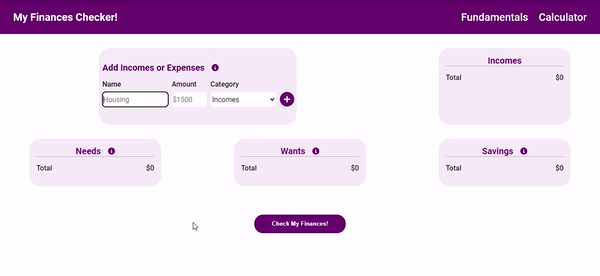

# Finances Checker

This is a calculator to help people gauge how healthy their monthly finances are. The app is using the 50-30-20 budgeting method to determine if a budget is well distributed or not.

## Preview

## Project walkthrough

### Welcome Page

This is the first page you will see when you open the app. Not much in here, if you are ready click Start.

### Fundamentals Page

Here you can find the explanation of this budgeting method. This section is entirely based on an [article](https://www.nerdwallet.com/article/finance/nerdwallet-budget-calculator) from NerdWallet, for more information please visit their site.

### Calculator

Here is where the magic happens.

First you will need to add incomes and expenses. In here the goal is to have everything listed, the more accurate the information the more realistic the final result will be.

You can click on the information icon on each category to display some useful tips.

If you made a mistake and the name or number for a certain income or expense is wrong you can delete it and add it one more time with the correct info.

Finally, once you have listed all of your incomes and expenses you can click Check My Finances! and the app will generate an assessment based on your inputs.